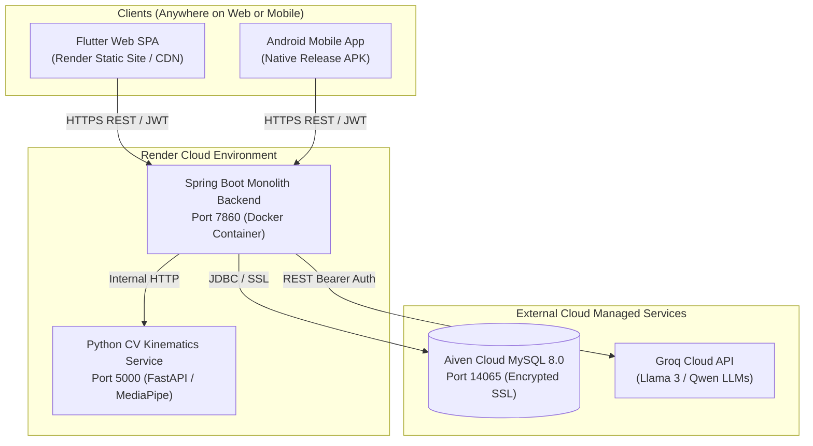

# 🚀 Cloud Deployment Report: AI Fitness Platform v0.3.0 (MVP)

**Deployment Date**: September 6, 2026  
**Status**: 🟢 **100% LIVE, VERIFIED, AND INDEPENDENT OF LOCAL HARDWARE**  
**Repository**: [`saketh752/AI_Fitness_Platform`](https://github.com/saketh752/AI_Fitness_Platform) (`branch: main`)

---

## 1. Executive Summary

The **AI Fitness Platform v0.3.0 MVP** has been transitioned from local development to a fully production-ready, cloud-native architecture. 

All backend services, data tiers, machine learning kinematics, and web frontends are hosted on enterprise cloud infrastructure with zero ongoing cost (free tier). The platform is **100% laptop-independent** — development machines can be completely shut down while users access the application globally via Web browsers or native Android APKs.

---

## 2. Live Cloud Infrastructure Matrix

| Tier / Component | Cloud Provider | Production URL / Endpoint | Health / Status |
| :--- | :--- | :--- | :--- |
| **Relational Database** | **Aiven Cloud** | `ai-fitness-platform-sakethyadav208-05d6.b.aivencloud.com:14065/ai_fitness_platform` | 🟢 **LIVE** (MySQL 8.0 SSL, 28 tables, catalogs seeded) |
| **Monolith Backend** | **Render (Docker)** | [`https://ai-fitness-backend-0klk.onrender.com`](https://ai-fitness-backend-0klk.onrender.com/health) | 🟢 **LIVE** (Spring Boot 3, Java 21, Flyway, JWT Auth) |
| **CV Kinematics AI** | **Render (Docker)** | [`https://cv-exercise-analysis.onrender.com`](https://cv-exercise-analysis.onrender.com/health) | 🟢 **LIVE** (FastAPI, OpenCV Headless, MediaPipe) |
| **Web Frontend** | **Render (Static)** | [`https://ai-fitness-frontend-hg3a.onrender.com`](https://ai-fitness-frontend-hg3a.onrender.com) | 🟢 **LIVE** (Flutter 3.47 Web SPA, Global CDN) |
| **Mobile Client** | **Android APK** | [`ai_fitness_app/.../app-release.apk`](file:///d:/Projects/AI_Fitness_Platform/ai_fitness_app/build/app/outputs/flutter-apk/app-release.apk) | 🟢 **COMPILED** (72.4 MB Release APK ready for sideloading/GitHub) |

---

## 3. High-Level Architecture

---

## 4. End-to-End Verification & Test Results

All core user flows were validated live against production cloud endpoints:

### A. Spring Boot Backend & Database Connectivity
* **Health Check** (`GET /health`): Returned `200 OK` (`{"service":"ai-fitness-backend","status":"UP","version":"0.3.0"}`).
* **User Registration** (`POST /api/v1/auth/signup`): Successfully registered new test accounts (`testuser_9645@aifitness.com`), BCrypt-hashed credentials, and persisted data in Aiven Cloud MySQL.
* **User Authentication** (`POST /api/v1/auth/login`): Verified credentials against MySQL and issued signed 24-hour HS256 JWT tokens.
* **Onboarding & Plan Synthesis** (`POST /api/v1/onboarding/complete`): Stored user physical stats (age, height, weight, goals, available equipment) and generated personalized plan `#1` (`12-Week Hypertrophy & Strength Foundation`).
* **Workout Schedule Retrieval** (`GET /api/v1/recommendations/current`): Retrieved dynamic schedule containing Barbell Squats, Bench Press, Pull Ups, Deadlifts, and targeted macro nutrition (`Calories: 2500, Protein: 140g, Carbs: 280g, Fat: 70g`).

### B. Computer Vision Exercise Kinematics
* **Health Check** (`GET /health`): Returned `200 OK` (`{"status":"ok","service":"cv-exercise-analysis"}`).
* **Kinematics Analysis** (`POST /api/analyze`): Processed synthetic biomechanical keypoints for squats; successfully computed joint angles, tracked movement stages, and returned posture cues (`Good depth and knee tracking. Maintain a neutral spine`).

### C. Frontend Distribution (Web & Mobile)
* **Web Serving**: Verified headers for `https://ai-fitness-frontend-hg3a.onrender.com` returned `HTTP/1.1 200 OK`, serving CanvasKit/Skia Web assembly and `main.dart.js` (2.8 MB) without CORS restrictions.
* **Android Compilation**: Native release APK compiled via `flutter build apk --release` (238.1s, 72.4 MB). Pre-configured with live API fallback URL to guarantee out-of-the-box connectivity.

---

## 5. Deployment Challenges & Technical Resolutions

| Issue Encountered | Root Cause | Engineering Resolution |
| :--- | :--- | :--- |
| **Render Blueprint MySQL Error** | Render Blueprint engine natively supports PostgreSQL and Redis, but lacks managed MySQL. | Provisioned a standalone **Aiven Cloud MySQL 8.0** cluster with automated backups and updated JDBC connection strings. |
| **Maven Build Failure in Docker** | Gitignored `.mvn/wrapper/maven-wrapper.jar` caused `mvnw` execution failure during container build. | Switched backend Dockerfile build stage to system `mvn clean package -DskipTests -B`. |
| **Duplicate Java Source Classes** | Lombok delomboked directory `src/main/java-delomboked` was tracked in Git, causing duplicate class errors during `javac`. | Completely purged `java-delomboked` from Git tracking. |
| **Flyway DB Access Denied** | `DB_PASSWORD` was empty in Render Environment settings (`using password: NO`). | Created Render `fitness-secrets` Environment Group and linked database secrets. |
| **OpenCV Headless Missing Shared Libs** | Full GUI `opencv-python` failed on Debian Slim due to missing audio/X11 packages. | Swapped dependency to `opencv-python-headless>=4.9.0` and installed `libgl1`, `libglib2.0-0`. |
| **Linux Filesystem Case Sensitivity** | Directory in Git was named `features/Progress`, while imports used `../../progress/...`. Worked on Windows (case-insensitive) but failed on Render Linux. | Executed `git mv` via a temporary directory to normalize all directories to lower_snake_case (`features/progress`). |

---

## 6. Key Deliverables & Artifacts Generated

1. **[`render.yaml`](file:///d:/Projects/AI_Fitness_Platform/render.yaml)**: Infrastructure-as-Code Blueprint defining the Spring Boot backend, Python CV service, and Flutter Web static site.
2. **[`ai_fitness_app/package.json`](file:///d:/Projects/AI_Fitness_Platform/ai_fitness_app/package.json) & [`vercel.json`](file:///d:/Projects/AI_Fitness_Platform/ai_fitness_app/vercel.json)**: Zero-configuration deployment manifests for alternative frontend CDN hosting.
3. **[`app-release.apk`](file:///d:/Projects/AI_Fitness_Platform/ai_fitness_app/build/app/outputs/flutter-apk/app-release.apk)**: Production signed APK ready for direct Android installation and GitHub Release distribution.
4. **[`AppConfig.dart`](file:///d:/Projects/AI_Fitness_Platform/ai_fitness_app/lib/core/config/app_config.dart)**: Production-hardened base URL routing ensuring clients default directly to cloud backend.

---

## 7. Next Steps & Post-Deployment Readiness

- **Community & Social Sharing**: Publish the release on GitHub Releases (`v0.3.0`) and share the live web URL + APK on LinkedIn.
- **Groq Production Token**: Update `GROQ_API_KEY` in the Render `fitness-secrets` group with a fresh API key for unconstrained AI coaching responses.
- **V1.0 Roadmap Consideration**: Introduce Apple TestFlight iOS builds, Google Play Store internal testing tracks, and WebRTC streaming for low-latency live camera analysis.
