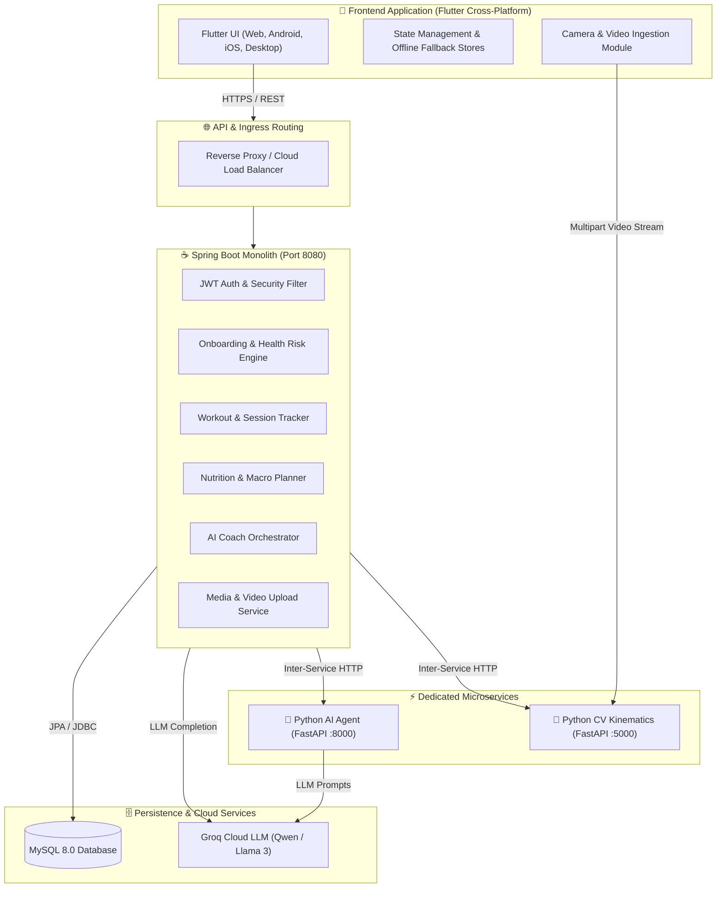

<div align="center">

# 🏋️‍♂️ AI Fitness Platform
### *Intelligent, Vision-Powered & Hyper-Personalized Fitness Ecosystem*

[](https://opensource.org/licenses/MIT)
[](https://flutter.dev)
[](https://spring.io/projects/spring-boot)
[](https://fastapi.tiangolo.com)
[](https://groq.com)
[](https://developers.google.com/mediapipe)
[](https://www.mysql.com)
[](https://www.docker.com)

<p align="center">
  <b>Real-Time Computer Vision Pose Correction</b> • <b>Adaptive AI Coaching via LLMs</b> • <b>Dynamic Workout & Nutrition Engines</b> • <b>Enterprise-Grade Security & Medical Risk Safeguards</b>
</p>

[Explore Features](#-core-features) • [System Architecture](#-system-architecture) • [Quick Start](#-quick-start) • [API Documentation](#-api-endpoints) • [Deployment](#-deployment) • [Contributing](#-contributing)

---

</div>

## 🌟 Executive Summary

**AI Fitness Platform** is an end-to-end, multi-tier intelligent health and athletic coaching ecosystem. It seamlessly bridges real-time **Computer Vision biomechanical kinematic tracking** with **LLM-driven conversational agents**, customized nutrition macro planning, active workout tracking, and health risk tripwires.

Whether analyzing barbell squats with sub-degree joint angle precision, generating context-aware 12-week progressive overload routines, or providing safe dietary advice based on localized ingredient budgets, the platform operates as your 24/7 athletic trainer and sports scientist in your pocket.

---

## ⚡ Core Features

<table>
  <tr>
    <td width="50%">
      <h3>🤖 Autonomous AI Coach (Groq / Llama 3 / Qwen)</h3>
      <ul>
        <li><b>Context-Aware Coaching:</b> Understands your current workout split, daily macro targets, height, weight, and fitness goals.</li>
        <li><b>Medical Safety Guardrails:</b> Automatically intercepts high-risk symptoms (e.g., chest pain, acute joint strain) and directs users to healthcare professionals before LLM processing.</li>
        <li><b>Conversational Memory:</b> Retains conversation history and session context for continuous progression.</li>
      </ul>
    </td>
    <td width="50%">
      <h3>👁️ CV Exercise Form & Kinematic Analysis</h3>
      <ul>
        <li><b>Real-Time Pose Estimation:</b> Powered by Google MediaPipe and OpenCV kinematic joint angle calculators.</li>
        <li><b>Multi-Exercise Tracking:</b> Precision feedback for Squats, Push-ups, Bicep Curls, Deadlifts, and Lunges.</li>
        <li><b>Form Scoring (0–100):</b> Real-time actionable cues regarding depth, elbow flare, neutral spine tracking, and tempo cadence.</li>
      </ul>
    </td>
  </tr>
  <tr>
    <td width="50%">
      <h3>📊 Active Workout Tracker & Gamification</h3>
      <ul>
        <li><b>Interactive Workout Player:</b> Live weight & rep adjustment, set completion logging, and countdown rest timers.</li>
        <li><b>Streak & XP Badges:</b> Gamified achievement milestones, daily completion streaks, and workout XP tracking.</li>
        <li><b>History & Progress Graphs:</b> Comprehensive weight trends, active volume logs, and PR tracking.</li>
      </ul>
    </td>
    <td width="50%">
      <h3>🥗 Precision Nutrition & Macro Planning</h3>
      <ul>
        <li><b>Dynamic Target Engine:</b> Personalized TDEE, BMR, and macro ratios (Protein, Carbs, Fats) tailored to individual goals.</li>
        <li><b>Ingredient & Budget Optimization:</b> Adapts recommendations according to dietary constraints and budget parameters.</li>
        <li><b>Real-Time Balance Tracker:</b> Interactive progress rings tracking remaining vs. consumed daily calories.</li>
      </ul>
    </td>
  </tr>
</table>

---

## 🏗️ System Architecture



---

## 🛠️ Technology Stack

<div align="center">

| Layer | Technologies |
| :--- | :--- |
| **Frontend Mobile / Web** | Flutter 3.x, Dart, Material 3, CachedNetworkImage, Provider |
| **Monolith Backend** | Java 21, Spring Boot 4.x, Spring Security, Spring Data JPA, Flyway |
| **AI Agent Service** | Python 3.11, FastAPI, Uvicorn, Pydantic, Groq SDK |
| **Computer Vision Engine** | Python 3.11, Google MediaPipe, OpenCV, NumPy, SciPy |
| **Database** | MySQL 8.0 (InnoDB, UTF8mb4) |
| **DevOps & Cloud** | Docker, Docker Compose, Render Blueprint, Firebase Hosting, Vercel |

</div>

---

## 📁 Repository Structure

```
AI_Fitness_Platform/
├── .github/                      # CI/CD Workflows, PR & Issue Templates
│   ├── workflows/ci.yml          # GitHub Actions Automated CI Pipeline
│   └── ISSUE_TEMPLATE/           # Standardized Bug & Feature Reports
├── ai-fitness-Backend/           # Java 21 / Spring Boot Monolith Service
│   ├── src/main/java/            # Controllers, Services, Entities & Repositories
│   ├── src/main/resources/       # application.yml, Flyway DB Migrations
│   └── Dockerfile                # Multi-Stage JDK 21 Alpine Container
├── ai-agent/                     # Python FastAPI Conversational Agent Microservice
│   ├── app/agent/                # Orchestrator, Action Builders & Memory Stores
│   ├── app/safety/               # Scope Checkers & Medical Safety Tripwires
│   └── Dockerfile                # Python 3.11 Slim Container
├── cv-exercise-analysis/         # Python FastAPI Computer Vision Microservice
│   ├── app/kinematics/           # Joint Angle Trigonometry & Repetition Counters
│   ├── main.py                   # REST Video Form Analysis Endpoint
│   └── Dockerfile                # OpenCV & MediaPipe Container
├── ai_fitness_app/               # Flutter Multiplatform Client (Mobile & Web)
│   ├── lib/features/             # Auth, Onboarding, AI Coach, Workouts, Nutrition
│   ├── lib/core/                 # Network Client, AppConfig & Theme Engine
│   └── test/                     # 42+ Unit & Widget Flow Test Suites
├── scripts/                      # Automated Release Packaging (.bat & .ps1)
├── docker-compose.yml            # 1-Click Multi-Container Stack Definition
├── render.yaml                   # Infrastructure-as-Code Blueprint for Render
├── DEPLOYMENT_GUIDE.md           # Step-by-Step Cloud & Self-Hosting Guide
└── LICENSE                       # MIT License
```

---

## 🚀 Quick Start (Local Development)

### Prerequisites
- **Git**, **Docker Desktop** (or local **Java 21**, **Python 3.11+**, and **Flutter SDK**)
- A free **Groq API Key** from [console.groq.com](https://console.groq.com/)

---

### Option 1: 1-Click Docker Compose (Fastest)

1. **Clone the repository:**
   ```bash
   git clone https://github.com/saketh752/AI_Fitness_Platform.git
   cd AI_Fitness_Platform
   ```

2. **Configure environment:**
   ```bash
   cp .env.example .env
   # Open .env and insert your GROQ_API_KEY
   ```

3. **Launch the entire stack:**
   ```bash
   docker compose up -d --build
   ```

4. **Run the Flutter client:**
   ```bash
   cd ai_fitness_app
   flutter run -d chrome
   ```

---

### Option 2: Individual Microservices

<details>
<summary><b>Click to expand manual setup instructions</b></summary>

#### 1. Start Python CV Service (Port 5000)
```bash
cd cv-exercise-analysis
python -m venv .venv
# On Windows: .\.venv\Scripts\activate | On macOS/Linux: source .venv/bin/activate
pip install -r requirements.txt
uvicorn main:app --host 0.0.0.0 --port 5000 --reload
```

#### 2. Start Python AI Agent (Port 8000)
```bash
cd ai-agent
python -m venv .venv
# Activate virtual environment
pip install -r requirements.txt
uvicorn app.main:app --host 0.0.0.0 --port 8000 --reload
```

#### 3. Start Spring Boot Backend (Port 8080)
Ensure MySQL is running on `localhost:3306`, then:
```bash
cd ai-fitness-Backend
# On Windows:
.\mvnw.cmd spring-boot:run
# On Linux/macOS:
./mvnw spring-boot:run
```

#### 4. Start Flutter Mobile/Web App
```bash
cd ai_fitness_app
flutter run
```
</details>

---

## 📡 API Endpoints

<details>
<summary><b>View Major Backend & Microservice REST Routes</b></summary>

### 🔐 Authentication (`/api/v1/auth`)
- `POST /api/v1/auth/signup` - Register user & receive JWT Bearer token
- `POST /api/v1/auth/login` - Authenticate & obtain session
- `POST /api/v1/auth/forgot-password` - Request password reset token

### 📋 Onboarding & Health (`/api/v1/onboarding`)
- `POST /api/v1/onboarding/complete` - Submit biometric profile, equipment, and injuries

### 🤖 AI Coach (`/api/v1/coach`)
- `POST /api/v1/coach/chat` - Conversational fitness coaching with safety intercepts
- `GET /api/v1/coach/history` - Retrieve chronological chat history

### 👁️ Form Analysis (`/api/v1/form-analysis`)
- `POST /api/v1/form-analysis/analyze` - Multipart video form upload & CV scoring

### 📊 Workouts & Nutrition
- `GET /api/v1/dashboard` - Daily metrics, streak counter, and activity cards
- `GET /api/v1/nutrition/today` - Today's calorie and macro consumption vs. targets
- `POST /api/v1/nutrition/log` - Log a meal with carbs, protein, and fat

</details>

---

## 🧪 Testing & Quality Assurance

All services are backed by comprehensive automated test suites:

```bash
# Run Flutter Unit & Widget Tests (42 Suites)
cd ai_fitness_app && flutter test

# Run AI Agent Test Suite (52 Suites)
cd ai-agent && pytest tests

# Run CV Kinematics Test Suite
cd cv-exercise-analysis && pytest tests
```

---

## 🚢 Deployment

Detailed deployment guides are available in [DEPLOYMENT_GUIDE.md](./DEPLOYMENT_GUIDE.md):
- **Managed Cloud (Render / Railway)**: 1-click deployment using `render.yaml`.
- **Flutter Web**: Deployable to Firebase Hosting or Vercel via `firebase.json` / `vercel.json`.
- **Android APK**: Automated release script available at `scripts/build_android_apk.bat`.

---

## 🤝 Contributing

Contributions, issues, and feature requests are welcome!
1. Fork the Project
2. Create your Feature Branch (`git checkout -b feature/AmazingFeature`)
3. Commit your Changes (`git commit -m 'Add some AmazingFeature'`)
4. Push to the Branch (`git push origin feature/AmazingFeature`)
5. Open a Pull Request

---

## 📄 License

Distributed under the **MIT License**. See [`LICENSE`](./LICENSE) for more information.

---

<div align="center">

**Developed with ❤️ by [Saketh Yadav](https://github.com/saketh752)**

*Star ⭐ this repository if you find it helpful!*

</div>

